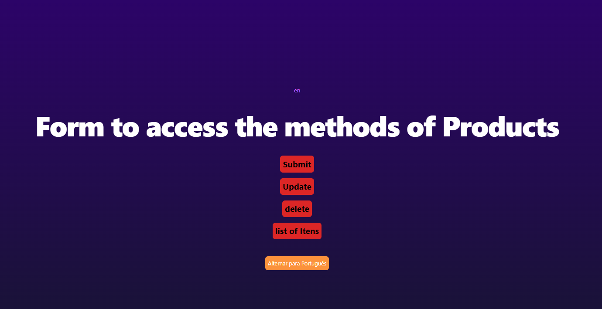
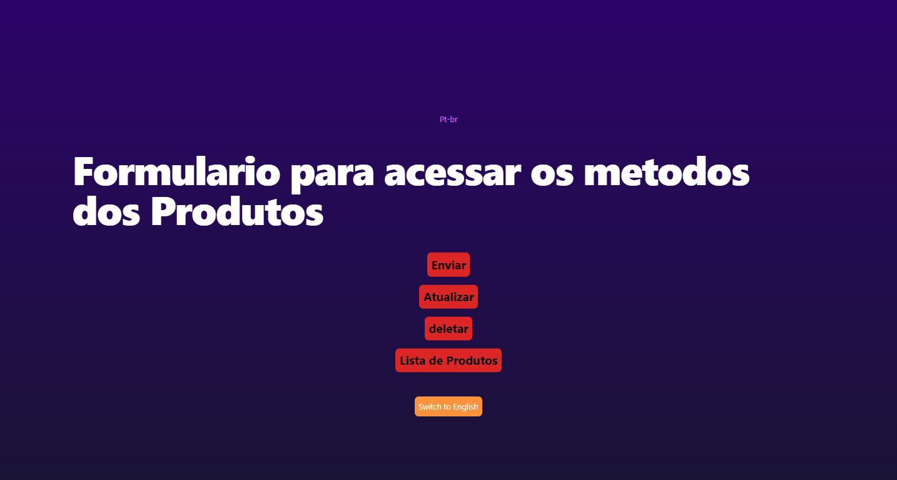
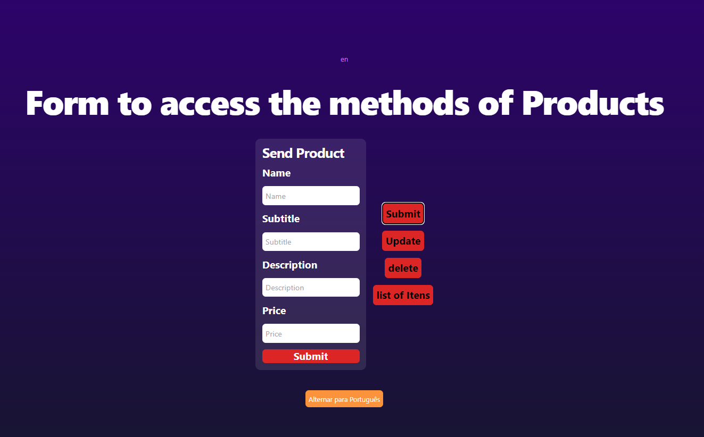
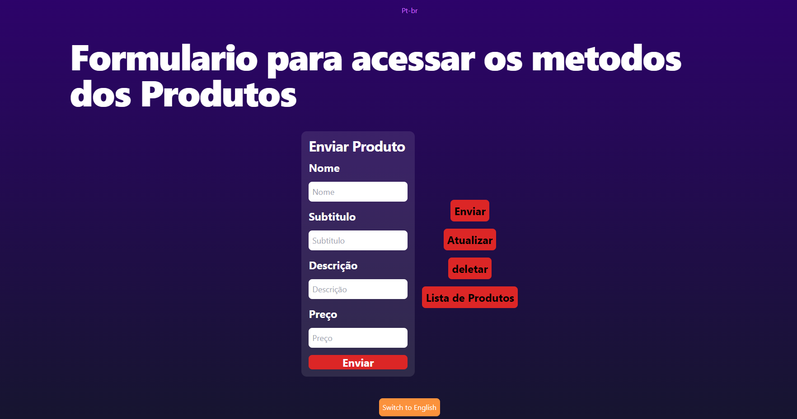
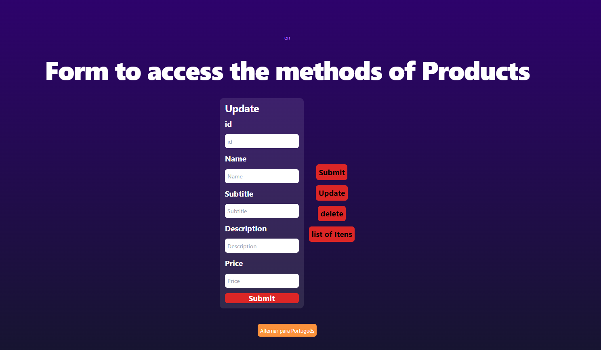
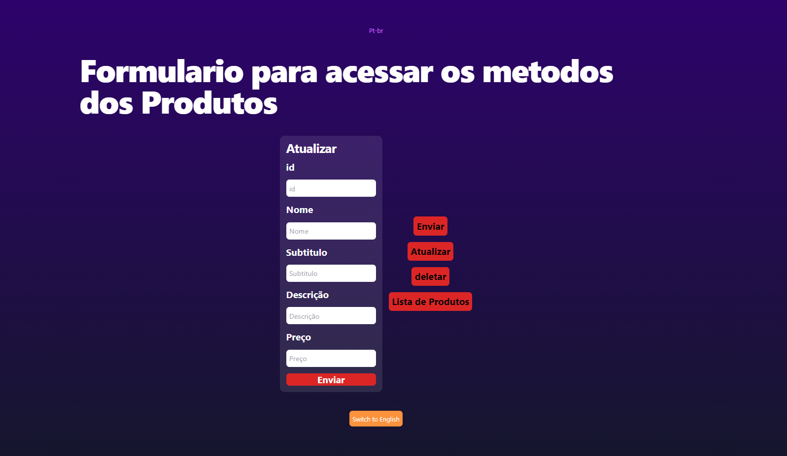
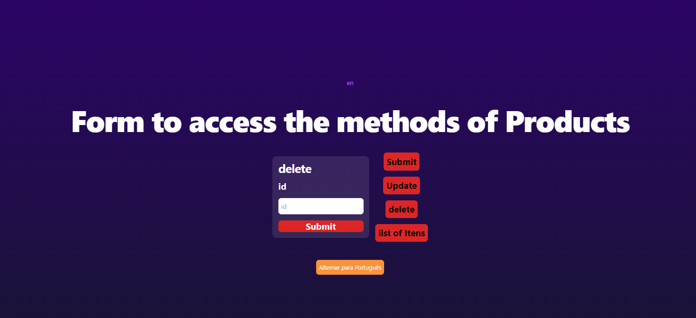
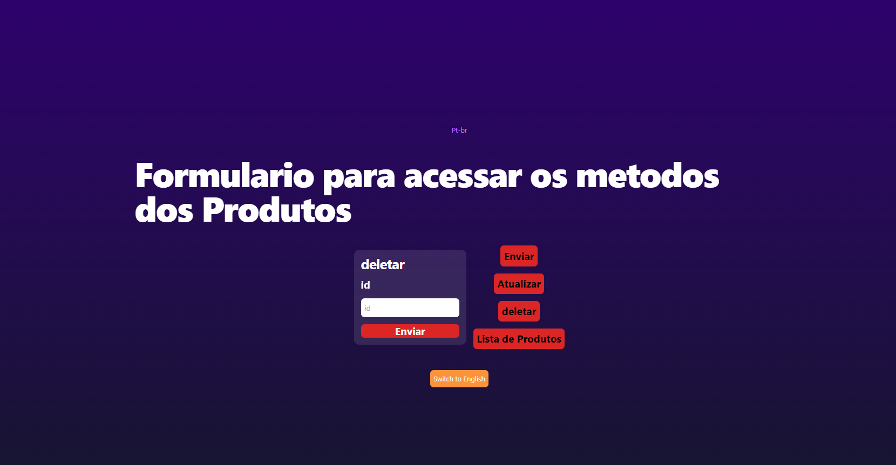
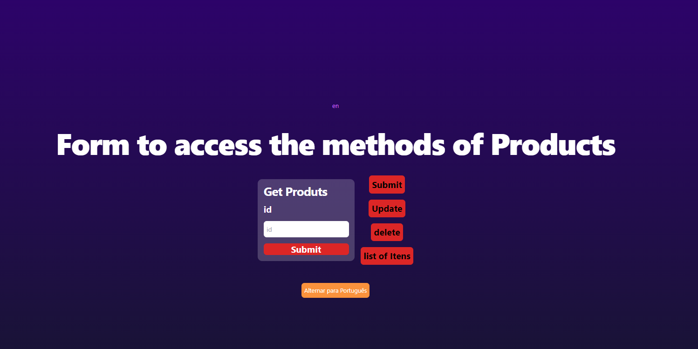
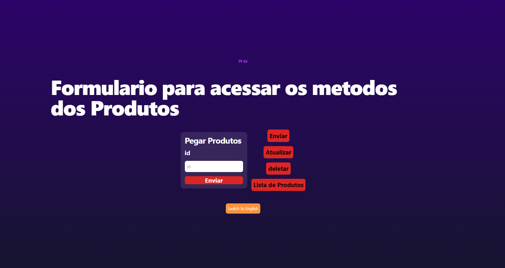

## RODAR O PROJETO
api-banco
Para rodar o projeto precisa de ter o docker instalado na maquina, e o nodejs.
e roda estes comando na pasta dos projeto.
```bash
npm install
docker-compose up -d
npm start
```
my-t3-app
```bash
npm install
npm run dev
```

### Cadastro de produtos

| Rota | Método | Descrição |
| --- | --- | --- |
| localhost:3030/produtos | GET | Lista todos os produtos cadastrados|
| localhost:3030/produtos/id | GET | Lista o produto cadastrado passando o id do mongoose|
| localhost:3030/produtos | POST | Cadastra produtos, em EN e PT.|
| localhost:3030/produtos/id | DELETE | Deletar o produtos passando o id do mongoose|
| localhost:3030/produtos/id | PUT | Atualiza o produto passando o id do mongoose|

## Schema do produtos

```javascript
const ProdutoSchema = new mongoose.Schema({
  en: { 
    name: String, 
    subtitle: String, 
    description: String, 
    price: Number },
  pt: { 
    name: String, 
    subtitle: String, 
    description: String, 
    price: Number 
}
});
```

## Imagens dos furmulários
#### Home


#### Enviar produto


#### Atualizar


#### Deletar


#### Listar

